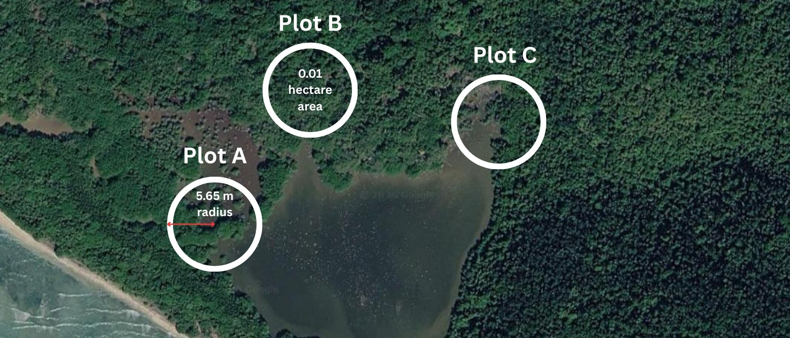
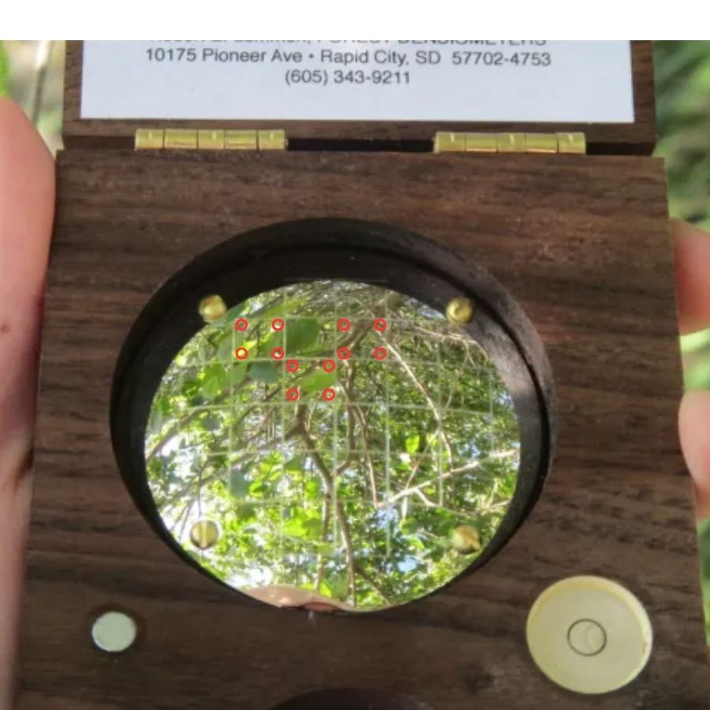

```{r setup, include=FALSE}

knitr::opts_chunk$set(
	echo = F,
	message = FALSE,
	warning = FALSE
)
# Needed Libraries
library(tidyverse)
library(gt)
library(readxl)
library(webshot2)
 
library(ggbreak)
library(leaflet)
library(htmltools)

# Source Plotting Functions
source("../scripts/TMMP_functions.R", local = knitr::knit_global())
source("../scripts/labeler.R", local = knitr::knit_global())
source("../scripts/theme_publication.R", local = knitr::knit_global())
source("../scripts/WoodyFunction.R", local = knitr::knit_global())


Mangrove_Input_Excel_File <- "../import_data/QA_QC_TMMP_March25_2025.xlsx"

tree_measurements <- read_xlsx(Mangrove_Input_Excel_File, sheet = "Tree measurements")
tree_heights <- read_xlsx(Mangrove_Input_Excel_File, sheet = "Tree heights")
site_coords <- read_xlsx(Mangrove_Input_Excel_File, sheet = "Coordinates")
densiometer_data <- read_xlsx(Mangrove_Input_Excel_File, sheet = "Densiometer data")
regen_data <- read_xlsx(Mangrove_Input_Excel_File, sheet = "Regeneration")
sapling_data <- read_xlsx(Mangrove_Input_Excel_File, sheet = "Sapling")
YSI_data <- read_xlsx(Mangrove_Input_Excel_File, sheet = "YSI Water Quality data")
Coarsewood <- read_csv("../import_data/QA_QC TMMP Data 6-25-25 - Coarse woody debris.csv")
FineWood <- read_csv("../import_data/QA_QC TMMP Data 6-25-25 - Wood debris.csv")
```


# **Program Overview**

## Column {width="50%"} {.tabset}

### **Program Origin**
The **T**erritorial **M**angrove **M**onitoring **P**rogram (TMMP) was established in 2021, and was designed to provide actionable, science-based information that supports effective local management and planning. 

The program aims to generate high-quality research, support science-based decision-making, guide restoration efforts, and elevate the role of mangroves in local and regional resilience planning.

The program supports workforce development, territorial partnerships, and applied coastal management by involving UVI students, alumni, researchers, and local partners in annual field monitoring activities.


TMMP was established by the University of the Virgin Islands in partnership with the Government of the Virgin Islands

TMMP is led by the Grimes Lab. The Grimes Lab operates in the Center for Marine and Environmental Studies at the University of the Virgin Islands. 


### **Program Vision**
Deliver critical time series information on the condition of mangrove ecosystems of the U.S. Virgin Islands to advance foundational and applied mangrove research and to enhance conservation and management. 

### **Program Objectives**

Establish **long-term mangrove monitoring plots** at sites **territory-wide**, following widely-used methods with consultation from U.S. Geological Survey (USGS) partners.

Monitor the **condition and trajectory of mangrove forests** across an array of **forest types, locations, acute stressors** (e.g., hurricanes, floods), and **chronic stressors** (e.g., droughts, sea-level rise, pollution, hydrological changes).

**Assess the natural recovery** of mangroves from the 2017 Hurricanes Irma and Maria.

**Fill an important gap** in coastal and marine ecosystem monitoring for the U.S. Virgin Islands by providing the **first, territory-wide, time series dataset for mangrove forests.**

**Assess condition of mangrove habitats** to connect shifts in mangrove forest health with unique stressors to provide the **most efficient and effective targeted management interventions,** including conservation and restoration.

### **Program Methods Overview**

19 sites across all three US Virgin islands are monitored annually. Some metrics are measured annually, some biennially.


#### Annually 
**Annually**
<br><br>

Regeneration Surveys

Environmental Metrics

#### Biennially 
**Biennially**
<br><br>

Adult Tree Measurements

Woody Debris

Canopy Coverage

# **Site Map**

## Column {width="50%"} {.tabset}

### General Site Map 

::: {.card}


U.S. Virgin Islands Territorial Mangrove Monitoring Program site map. Sites across St. Thomas, St. John and St. Croix are classified as either basin, fringe, or salt pond systems. There are 8 sites on St. Thomas (Brewers Bay, Compass Point, Magens Bay, Mandahl Bay, Perseverance Bay, St. Thomas East End Reserves Basin, St. Thomas East End Reserves Fringe, and Vessup Bay), 7 sites on St. John (Francis Bay, Lameshur Bay, Mary Creek, Princess Bay, Reef Bay, Turner Bay, and Water Creek), and 4 sites on St. Croix (Great Pond, Krause Lagoon, Salt River, and Southgate). 

:::

### **Methods**
Territorial Mangrove Monitoring Program Sites were selected with input from the Department of Planning and Natural Resources and the National Parks Service. Selected sites represent the dynamic mangrove conditions found across the Territory and include the three **mangrove forest typologies** found in the USVI (fringing, basin, and salt pond).

Eight sites are located within  the National Park Service boundaries of the Virgin Islands National Park and Virgin Islands Coral Reef National
Monument (Vessup Bay, Francis Bay, Lameshur Bay, Mary Creek, Princess Bay, Reef Bay, and Water Creek) and Salt River Bay National Historical Park and Ecological Preserve (Salt River), 5 sites are located within territorial parks and protected areas: the St. Croix East End Marine Park (Great Pond), the Southgate Coastal Reserve (Southgate), and the St. Thomas East End Reserves (STEER Basin, STEER Fringe, Compass Point), and one site (Magens Bay) is located in the Magens Bay Watershed Preserve co-managed by Magens Bay Authority, VI Department of Planning & Nature Resources, and The Nature Conservancy.

At each site, three permanent 0.01 hectare circular plots, with a radius of 5.65m were established at least 10 meters apart. 

{width=70%}


### Forest Typologies

::: {.columns style="gap: 0;"}

::: {.column width="50%"}
{width="800px"}

<br><br><br>

{width="100%"}

<br><br><br>

{width="100%"}
:::

::: {.column width="50%" style="min-width: 0; width: 50%;"}
**Fringe Forest** | Fringe mangrove forests grow along coastlines where trees are regularly flooded by tides. These forests act as the first line of defense against coastal erosion and storm surges, as their dense root systems support shoreline stability. Fringe mangroves thrive in areas with high tidal flushing, which brings in nutrients and reduces salt stress, sometimes allowing for taller and more robust mangrove growth compared to other mangrove forest types. They provide critical habitat for marine life and serve as important nursery grounds for fish and invertebrates. Fringe mangrove forests are the most common typology in the U.S. Virgin Islands.

<br><br>

**Basin Forest** | Basin mangrove forests form in low-energy, inland depressions or basins, where water drainage is slow and tidal influence is reduced. These forests are typically found further from the shoreline, in areas where seawater or brackish water collects, often leading to high organic matter accumulation and variable salinity levels. Due to limited tidal flushing, basin forests can have anoxic but nutrient-rich conditions, which can support dense mangrove growth. Basin mangroves play a crucial role in carbon storage, water filtration, and habitat for diverse marine and terrestrial species, such as the culturally-important land crab fishery.

<br><br>

**Salt Ponds** | Salt pond mangrove forests form around coastal salt ponds or lagoons, where water is often highly saline and stagnant due to limited tidal exchange. Typically, mangroves are found along the outer fringe of open, ponded bodies of water that can dry out seasonally. These forests can experience extreme salt stress, leading to stunted mangrove growth and lower species diversity compared to other mangrove types. They are commonly found with thick clay soils characterized by poor drainage, where evaporation increases salinity levels. Despite harsh conditions, salt pond mangroves provide critical habitat for wildlife, especially nesting shorebirds, and contribute to coastal stability.
:::

:::


# **Canopy Cover**


## Column {width="80%"} {.tabset}


```{r}
#| title: Canopy Cover
#| fig-cap: "Average canopy cover at each site broken into living vegetation (green), stems/trunks (brown), and open sky (blue)."
#| cache: true

densiometer_figure(densiometer_data = densiometer_data)

```


```{r}
#| title: Canopy Data Table
#| cache: true
#| tbl-cap: "Percent cover of living vegetation, stems/trunks, and open sky (Mean (+/-) Standard Error) across survey years for all Territorial Mangrove Monitoring Program sites."

densiometer_data_table(densiometer_data = densiometer_data) %>%
    tab_options(table.width = "75%") %>% 
    opt_table_font(size = "18px")

```


### Methods

::: {.columns style="gap: 0;"}

::: {.column width="50%"}

{width=100%}

<br>

{width=100%}

<br>

{width=100%}

:::

::: {.column width="50%" style="min-width: 0; width: 70%;"}

<br><br><br><br><br><br>

**Canopy coverage** is the percentage of the sky obscured by the forest canopy; this measurement can provide a rapid snapshot of forest health and degradation.A spherical densiometer is used to estimate canopy cover by measuring the percentage of a curved mirror that is covered by living vegetation, stem/tree trunks, and open sky.
 
 <br><br><br><br><br><br><br><br><br>

The counter imagines a small dot in the corners of each square on the curved mirror surface. The number of dots covered by open sky, woody stems, and living vegetation is tallied. These numbers are used to summarize canopy cover. 

<br><br><br><br><br><br><br><br><br>

Each year, four measurements facing the cardinal directions (N, S, E, W) are taken from the center of every plot.

:::

:::


# **Adult Tree Metrics** {.tabset}

## Column {width=80%} {.tabset}


```{r}
#| cache: true
#| title: Metrics Map
#| fig-cap: "This map shows changes in four adult tree metrics (Living Basal Area, Dead Basal Area, Tree Height, & Stem Density) between 2022 and 2024 across all sample sites. It also shows forest types. If metrics increased, circles will be yellow, if metrics decreased circles will be red. The larger the circle the higher the magnitude of the change."


total_basal_change <- total_basal_area_change(tree_measurements = tree_measurements)
total_basal_change_dead <- total_basal_area_change_dead(tree_measurements = tree_measurements)
total_height_change <- total_tree_height_change(tree_heights = tree_heights)
total_stem_density_change <- total_stem_density_change(tree_measurements = tree_measurements)
site_data <- site_coordinates(Coordinates = site_coords)

data <- Reduce(function(x, y) merge(x, y, all = TRUE), list(total_basal_change, 
                                                            total_basal_change_dead, 
                                                            total_height_change, 
                                                            total_stem_density_change)) %>% 
  left_join(site_data) %>% 
    mutate(direction = ifelse(total_change > 0, "pos", "neg"),
           direction_dead = ifelse(total_change_dead > 0, "pos", "neg"),
           direction_height = ifelse(height_change > 0, "pos", "neg"),
           direction_density = ifelse(stem_density_change > 0, "pos", "neg"))


# Assume total_basal_change is already created
# data <- 
#   mutate(direction = ifelse(total_change > 0, "pos", "neg"),
#          direction_dead = ifelse(total_change_dead > 0, "pos", "neg"))

# Color palettes
change_pal <- colorFactor(c("#FF0000", "#E6E600"), domain = c("pos", "neg"))

typology_pal <- colorFactor(c("black", "orange", "blue"), domain = data$Typology)

# Initialize leaflet map
leaflet(data) %>%
  addTiles() %>%

  # Layer 1: Total Change
  addCircles(
    group = "Living Basal Change",
    lng = ~Longitude,
    lat = ~Latitude,
    radius = ~(abs(total_change) +5) * 75,
    popup = ~paste0("<strong>Site:</strong> ", Site,
                    "<br><strong>Change:</strong> ", round(total_change, 2)),
    color = "black",
    fillColor = ~change_pal(direction),
    fillOpacity = 0.9,
    stroke = TRUE
  ) %>%
  
    # Layer 2: Total Change Dead
  addCircles(
    group = "Dead Basal Change",
    lng = ~Longitude,
    lat = ~Latitude,
    radius = ~(abs(total_change_dead) +5) * 75,
    popup = ~paste0("<strong>Site:</strong> ", Site,
                    "<br><strong>Change:</strong> ", round(total_change_dead, 2)),
    color = "black",
    fillColor = ~change_pal(direction_dead),
    fillOpacity = 0.9,
    stroke = TRUE
  ) %>%
  
      # Layer 3: Total Height Change
  addCircles(
    group = "Tree Height Change",
    lng = ~Longitude,
    lat = ~Latitude,
    radius = ~(abs(height_change) +5) * 75,
    popup = ~paste0("<strong>Site:</strong> ", Site,
                    "<br><strong>Change:</strong> ", round(height_change, 2)),
    color = "black",
    fillColor = ~change_pal(direction_height),
    fillOpacity = 0.9,
    stroke = TRUE
  ) %>%
  
        # Layer 4: Total Stem Density Change
  addCircles(
    group = "Stem Density Change",
    lng = ~Longitude,
    lat = ~Latitude,
    radius = ~(abs(stem_density_change) / 3),
    popup = ~paste0("<strong>Site:</strong> ", Site,
                    "<br><strong>Change:</strong> ", round(stem_density_change, 2)),
    color = "black",
    fillColor = ~change_pal(direction_density),
    fillOpacity = 0.9,
    stroke = TRUE
  ) %>%

  # Layer 5: Typology
  addCircleMarkers(
    group = "Forest Type",
    lng = ~Longitude,
    lat = ~Latitude,
    radius = 10,
    popup = ~paste0("<strong>Site:</strong> ", Site,
                    "<br><strong>Forest Type:</strong> ", Typology),
    color = ~typology_pal(Typology),
    fillOpacity = 0.9,
    stroke = TRUE,
    weight = 1
  ) %>%
  
  #   # Site Labels, turned off for now, looks messy
  # addLabelOnlyMarkers(
  #   lng = ~Longitude,
  #   lat = ~Latitude,
  #   label = ~Site,
  #   labelOptions = labelOptions(
  #     noHide = TRUE,
  #     direction = "bottom",
  #     textOnly = TRUE,
  #     color = "black",
  #     style = list(
  #       "font-family" = "serif",
  #       "font-style" = "bold",
  #       "font-size" = "12px",
  #       "pointer-events" = "none"
  #     )
  #   )
  # ) %>%
  
addControl(
  html = HTML("
    <div style='background: white; padding: 15px 20px; border-radius: 8px; box-shadow: 0 2px 6px rgba(0,0,0,0.3); font-family: sans-serif; width: 420px; text-align: center;'>

      <!-- Title -->
      <div style='font-weight: bold; font-size: 14px; margin-bottom: 10px;'>Mean Change from 2022-2024</div>

      <!-- Circle legend -->
      <div style='display: flex; justify-content: space-between; align-items: center; margin-bottom: 5px; font-size: 12px;'>
        <div><strong>Negative</strong></div>
        <div><strong>Positive</strong></div>
      </div>

      <svg width='100%' height='55'>
        <!-- Red circles (negative change) -->
        <circle cx='32' cy='25' r='20' fill='#FF0000' stroke='black' stroke-width='1'/>
        <circle cx='72' cy='25' r='15' fill='#FF0000' stroke='black' stroke-width='1'/>
        <circle cx='108' cy='25' r='12' fill='#FF0000' stroke='black' stroke-width='1'/>
        <circle cx='138' cy='25' r='9'  fill='#FF0000' stroke='black' stroke-width='1'/>
        <circle cx='162' cy='25' r='6'  fill='#FF0000' stroke='black' stroke-width='1'/>

        <!-- Yellow circles (positive change) -->
        <circle cx='198' cy='25' r='6'  fill='#E6E600' stroke='black' stroke-width='1'/>
        <circle cx='222' cy='25' r='9'  fill='#E6E600' stroke='black' stroke-width='1'/>
        <circle cx='252' cy='25' r='12' fill='#E6E600' stroke='black' stroke-width='1'/>
        <circle cx='288' cy='25' r='15' fill='#E6E600' stroke='black' stroke-width='1'/>
        <circle cx='328' cy='25' r='20' fill='#E6E600' stroke='black' stroke-width='1'/>
      </svg>

      <!-- Spacer -->
      <div style='height: 10px;'></div>

      <!-- Forest Type Title -->
      <div style='font-weight: bold; font-size: 14px; margin-bottom: 5px;'>Typology</div>

      <!-- Forest Type legend -->
      <svg width='100%' height='40'>
        <circle cx='100' cy='15' r='8' fill='black' stroke='black' stroke-width='1'/>
        <text x='90' y='35' font-size='12'>Basin</text>

        <circle cx='180' cy='15' r='8' fill='orange' stroke='black' stroke-width='1'/>
        <text x='165' y='35' font-size='12'>Fringe</text>

        <circle cx='260' cy='15' r='8' fill='blue' stroke='black' stroke-width='1'/>
        <text x='240' y='35' font-size='12'>Salt Pond</text>
      </svg>

    </div>
  "),
  position = "bottomleft"
) %>% 

  # Layers control
  addLayersControl(
    baseGroups = c("Living Basal Change", "Dead Basal Change", "Tree Height Change", "Stem Density Change","Forest Type"),
    options = layersControlOptions(collapsed = FALSE)
  ) %>% 
  
  setView( lng = -64.8, lat = 18.0, zoom = 10 ) %>% 
  addProviderTiles("Esri.OceanBasemap")
  
```

### **Species Distribution**

#### **Fringe Sites**
```{r}
#| title: Tree Counts Fringe
#| cache: true

#Here I am going to put the stacked bar-plots of tree counts by species, I need to make the figure into a function that loops through the years and then stacks all the years on top of each other

#need to decide if I want to group by island/by forest type


```

#### ** Basin Sites**
```{r}
#| title: Tree Counts Basin
#| cache: true

#Here I am going to put the stacked bar-plots of tree counts by species, I need to make the figure into a function that loops through the years and then stacks all the years on top of each other

#need to decide if I want to group by island/by forest type


```
#### **Salt Pond Sites**
```{r}
#| title: Tree Counts Salt Pond
#| cache: true

#Here I am going to put the stacked bar-plots of tree counts by species, I need to make the figure into a function that loops through the years and then stacks all the years on top of each other

#need to decide if I want to group by island/by forest type


```

### **Tree Measurements Table**
```{r}
#| cache: true
#| tbl-cap: "Summary of mean mangrove tree measurements for all Territorial Mangrove Monitoring Program sites including height (m), living basal area (m2/ha), density (stems/ha) and relative distribution of the three mangrove species (Rhizophora mangle, Avicennia germinans, and Laguncularia racemosa) representing the living and dead basal area across survey years."

create_tree_measurement_table(tree_measurements = tree_measurements, tree_heights = tree_heights) %>% 
  tab_options(table.width = "75%") %>% 
    opt_table_font(size = "18px")
```

### Methods

::: {.columns style="gap: 0;"}

::: {.column width="50%"}

{width=100%}

{width=100%}

{width=100%}

<br>

{width=100%}


:::

::: {.column width="50%" style="min-width: 0; width: 70%;"}


Every two years (Biennially) the diameter of every tree (both living and standing dead) located within a plot is measured at a standard height above the ground (1.37 meters or breast height). **Diameter at Breast Height (DBH)** measurements are used to calculate the *basal area** of the plot

**Diameter at Breast Height (DBH):** The diameter of a tree at a standard height above the ground, in the Unites States Breast height is defined as 1.37 meters.

**Basal Area** The sum of the cross sectional area that trees occupy within the plot 

**Tree Heights:** Each year, between 5-9 living or standing dead trees within each plot are randomly selected. For each tree, height is either estimated to the nearest half meter using an extendable tree pole with height markings or calculated using a laser range finder.

**Living Basal Change:** Living Basal Area is how much ground area living tree stems occupy in a forest stand. Living basal areas were averaged across the three plots at each site. The average living basal area in 2024 was subtracted from the average living basal area in 2022 to determine change in living basal area at each site.  

A positive (yellow) change in living basal area indicates on average there is tree growth at this site. A negative (red) change in living basal area indicates on average there is tree death at the site. The larger the circle the higher the magnitude of change.


**Dead Basal Change:** Dead Basal Area is how much ground area standing dead stems occupy in a forest stand. Dead basal areas are averaged across the three plots at each site. The average basal area in 2024 was subtracted from the average basal area in 2022 to determine change in basal area at each site.  

A positive (yellow) change in basal area indicates on average there are more standing dead trees at this site. A negative (red) change in basal area indicates on average there are less standing dead trees at this site. The larger the circle the higher the magnitude of change.


**Tree Height Change:** Individual tree heights were averaged for each site. This average height in 2024 was subtracted from average height in 2022 to determine change in height at each site. 

**Stem Density Change:** Stem Density is a measure of the number of trees per hectare. The total number of trees in each plot is measured every two years. These numbers along with the plot size are used to calculate stem density.

Stem densities are averaged across three plots at each site. The average stem density in 2024 was subtracted from the average stem density in 2022 to determine change in stem density at each site. 

A positive (yellow) change in stem density indicates an increase in stems at this site. A negative (red) change in stem density indicates a decrease stem density at this site. The larger the circle the higher the magnitude of change.

:::

:::

# **Tree Sizes**{.tabset}

## Column {width=80%} {.tabset}

#### By Year {.tabset}

```{r results='asis', echo=FALSE, fig.width=12, fig.height=7}
#| title: "2022"
#| cache: true
#| fig-cap: "Relative frequency of trees in each size range at each site. Sizes are shown as diameter at breast height (DBH). Values are scaled to the total number of observed trees at each site. Green indicates living trees, brown indicates standing dead trees."

all_sites_LF(tree_measurements = tree_measurements, year = 2022, bin_size = 3)


```

```{r results='asis', echo=FALSE, fig.width=12, fig.height=7}
#| title: "2024"
#| cache: true
#| fig-cap: "Relative frequency of trees across size ranges at each site. Sizes are shown as diameter at breast height (DBH). Values are scaled to the total number of observed trees at each site. Green indicates living trees, brown indicates standing dead trees."

all_sites_LF(tree_measurements = tree_measurements, year = 2024, bin_size = 3)


```


#### St. Thomas {.tabset}


```{r results='asis', echo=FALSE, fig.width=9.8, fig.height=7.5}
#| cache: true
#| fig-cap: "Relative frequency of trees across size ranges. Sizes are shown as diameter at breast height (DBH). Values are scaled to the total number of observed trees at each site. Green indicates living trees, brown indicates standing dead trees."

island <- densiometer_data %>% 
  filter(Island == "St Thomas") %>% 
  reframe(Site = unique(Site))

for(i in island$Site) {
  
  cat("  \n#####",  i, "\n")
  
  print(site_LF(tree_measurements = tree_measurements, site = i, bin_size = 3))
  
  cat("  \n")
}


```

#### St. John {.tabset}


```{r results='asis', echo=FALSE, fig.width=9.8, fig.height=7.5}
#| cache: true
#| fig-cap: "Relative frequency of trees across size ranges. Sizes are shown as diameter at breast height (DBH). Values are scaled to the total number of observed trees at each site. Green indicates living trees, brown indicates standing dead trees."

island <- densiometer_data %>% 
  filter(Island =="St John") %>% 
  reframe(Site = unique(Site))

for(i in island$Site) {
  
  cat("  \n#####",  i, "\n")
  
  print(site_LF(tree_measurements = tree_measurements, site = i, bin_size = 3))
  
  cat("  \n")
}


```

#### St. Croix {.tabset}


```{r results='asis', echo=FALSE, fig.width=9.8, fig.height=7.5}
#| cache: true
#| fig-cap: "Relative frequency of trees across size ranges. Sizes are shown as diameter at breast height (DBH). Values are scaled to the total number of observed trees at each site. Green indicates living trees, brown indicates standing dead trees."

island <- densiometer_data %>% 
  filter(Island =="St Croix") %>% 
  reframe(Site = unique(Site))

for(i in island$Site) {
  
  cat("  \n#####",  i, "\n")
  
  print(site_LF(tree_measurements = tree_measurements, site = i, bin_size = 3))
  
  cat("  \n")
}


```

#### Methods

The **Diameter at Breast height (DBH)** measurement is recorded for every **adult tree** both living and dead located within the plots every two years. 

**Diameter at Breast Height (DBH):** The diameter of a tree at a standard height above the ground, in the Unites States Breast height is defined as 1.37 meters.


**Adult trees** are any tree with a DBH greater than 2.5cm. 

{width=60%}


# **Regeneration** {.tabset}

## Column {width=80%} {.tabset}

### **Seedlings** {.tabset}

#### **Seedling Density**

Young trees that are rooted in the ground and less than 50cm tall are classified as **seedlings**. 


```{r}
#| padding: 2px
#| fig-cap: "Average seedling density (seedlings per square meter) at each site . Stars show average height of the tallest seedling"
#| fig-align: center
#| cache: true
 
seedling_density(regen = regen_data, densio = densiometer_data, breaks = 15)

```


#### **Seedling Density Table**
```{r}
#| title: Seedling Density Table
#| tbl-cap: "Summary of the average seedling density by species at each site across sample years"
#| padding: 2px
#| cache: true
 

seedling_rel_abundance_table(regen_data = regen_data) %>% 
  tab_options(table.width = "75%") %>% 
    opt_table_font(size = "18px")
```


### **Saplings** {.tabset}

#### **Saplings**

#####
Young trees that are taller than 50cm, and with a diameter at breast height (DBH) less than 2.5cm are classified as **saplings**.

#####
{width=80%}

#### **R. mangle Density**
```{r}
#| title: R. mangle Density
#| cache: true
#| fig-cap: "Mean density (saplings per square meter) of R. mangle saplings across Territorial Mangrove Monitoring Sites. Stars indicate mean sapling height (cm)"
sapling_density(regen =  regen_data, sapling = sapling_data, species = "RHMA", densio = densiometer_data) 
```

#### **A. germinans Density**
```{r}
#| title: A. germinans Density
#| cache: true
#| fig-cap: "Mean density (saplings per square meter) of A. germinans saplings across Territorial Mangrove Monitoring Sites. Stars indicate mean sapling height (cm)"
sapling_density(regen =  regen_data, sapling = sapling_data, species = "AVGE", densio = densiometer_data)
```

#### **L. racemosa Density**
```{r}
#| title: L. racemosa Density
#| cache: true
#| fig-cap: "Mean density (saplings per square meter) of L. racemosa saplings across Territorial Mangrove Monitoring Sites. Stars indicate mean sapling height (cm)"

sapling_density(regen =  regen_data, sapling = sapling_data, species = "LARA", densio = densiometer_data)
```

#### **Sapling Density Table**
```{r}
#| title: Sapling Density Table
#| padding: 2px
#| cache: true
#| tbl-cap: "Mean sapling density (+/-) Standard Error across all Territorial Mangrove Monitoring Sites in all sample years"
 
sapling_rel_abundance_table(regen =  regen_data, sapling = sapling_data, species = "RHMA", densio = densiometer_data) %>% 
  tab_options(table.width = "75%") %>% 
    opt_table_font(size = "18px")
```


### **Methods**

::: {.column width="100%"}

Regeneration surveys measure all steps of mangrove reproduction including seed germination, seed or propagule development, dispersal, establishment and growth into seedlings and saplings.

Regeneration is measured in four replicate 1 square meter quadrats, placed in the same location annually: from 4.65 m to 5.65 m out from the radial plot’s center in each cardinal direction (N, S, E, W). All seeds and propagules within these quadrats are counted and identified to species with root presence noted, all **seedlings** are identified to species and tallied, the height and species of the tallest seedling is recorded, each **sapling** is identified to species and measured for height and **DBH**. For any saplings shorter than 1.4 m, diameter is recorded at the base of the tree.

**Seedlings** are any mangrove with a height less than 50 cm.

**Saplings** are mangroves taller than 50 cm with a DBH less than 2.5 cm.

**DBH** — Diameter at Breast Height: the diameter of a tree 1.4 meters above the ground.

:::

::: {.columns style="display: flex !important; flex-direction: row !important; flex-wrap: nowrap !important; gap: 0 !important; margin: 0 !important; padding: 0 !important;"}

::: {.column style="width: 25% !important; flex: 0 0 25% !important; padding: 0 !important; margin: 0 !important;"}

{width=100%}

:::

::: {.column style="width: 25% !important; flex: 0 0 25% !important; padding: 0 !important; margin: 0 !important;"}

{width=100%}

:::

::: {.column style="width: 25% !important; flex: 0 0 25% !important; padding: 0 !important; margin: 0 !important;"}

{width=100%}

:::

::: {.column style="width: 25% !important; flex: 0 0 25% !important; padding: 0 !important; margin: 0 !important;"}

{width=100%}

:::

:::


# Woody Debris

```{r, , cache=FALSE}
#| title: Woody Debris
#| padding: 2px
#| cache: true

WoodyDataFrame<-WoodyDF(FineWood = FineWood, CoarseWood = Coarsewood)
WoodyBoxPlot(WoodyDataFrame)

```


# **Water Quality**

## Column {width=80%} {.tabset}

```{r}
#| title: Water Quality
#| cache: true

water_qual_table(YSI = YSI_data) %>% 
  tab_options(table.width = "75%") %>% 
  opt_table_font(size = "18px")
```
 
# Partners
 
University of the Virgin Islands (UVI)
Virgin Islands Department of Planning and Natural Resources (DPNR)
Division of Coastal Zone Management
Division of Fish and Wildlife
National Park Service (NPS)
Virgin Islands EcoTours
St. Croix Environmental Association
U.S. Geological Survey (USGS).

# Field Crew

We want to thank everyone who has gotten out into the mud and the mangroves with us and helped collect this data, it wouldn't have been possible without you!

**2022 Field Crew**
Allison Holevoet, Allie Durdall, Calypso, Camille, Caroline Pott, Ellie, Heather Stewart, Hilary, Jen Vailulus, Jenna Cheramie, Jonathan Turbe, Julia Plotkin, Kayla Halliday, Kelcie, Kristin Wilson Grimes, Laura Bloem, Lila Uzzell, Lincoln Critchley, Pedro Nieves, Sierrah Mueller, Victoria Beasly, Zach Briggs

**2023 Field Crew**
Allie Durdall, Allison Holevoet, Denny Gonzalez, Jordan Silva, Julia Plotkin, Kayla Halliday, Kristin Wilson Grimes, Kwami Alexander, Laura Bloem, Lila Uzzell, Miranda Goad, Molly Mason (KT, TNT,LB)

**2024 Field Crew**
Allie Durdall, Denny Gonzalez, Helova Mathurin, Jonicia Cardin, Kaitlin Rommelfanger, Kayla Halliday, Kristin Wilson Grimes, Lila Uzzell, Sarai Hutchinson, Sierrah Mueller, Jordan Silva, (TC, JH, NK, HB)  

**2025 Field Crew**
Aaliya Warner Rawlins, Allie Durdall, Kaitlin Rommelfanger, Kristin Wilson Grimes, Lila Uzzell, Laura Bloem, Miranda Goad, Sarai Hutchinson, Shelby Adkins, Sophia Bilotta, Taquanna Baron, Tara Thompson (Need to Add Featherleaf People)

**2026 Field Crew**


 
# Contact Us

The Territorial Mangrove Monitoring Program is led by the Grimes Lab who operates in the Center for Marine and Environmental Studies at the University of the Virgin Islands.

Have questions, or want more information about the Territorial Mangrove Monitoring Program?

Contact us at grroevi@gmail.com
 